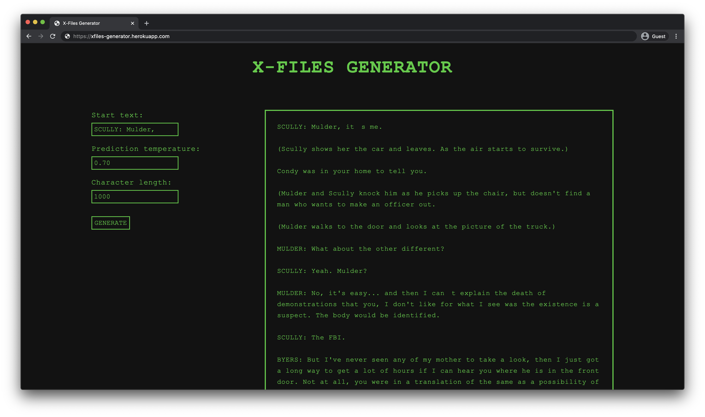

# xfiles-generator
Web app that uses a character-based GRU RNN model to generate and display new X-Files script text. Written in Python using TensorFlow and Flask.

https://xfiles-generator.herokuapp.com

#### To Do (in progress):
- Vastly improve generation speed.
